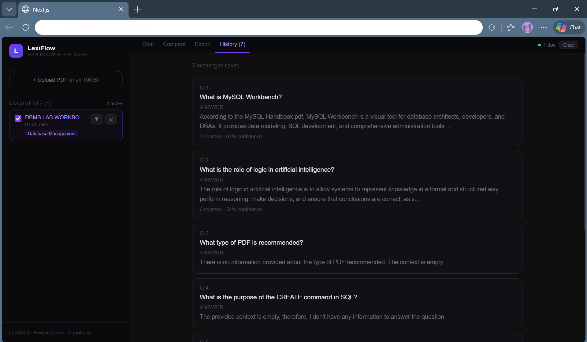
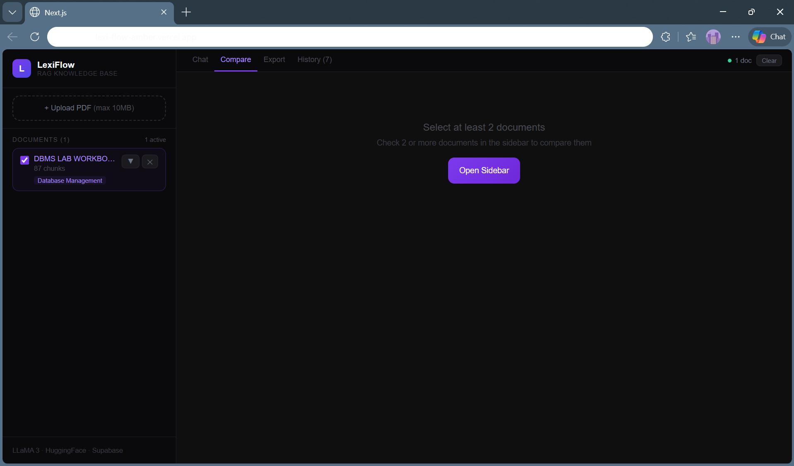
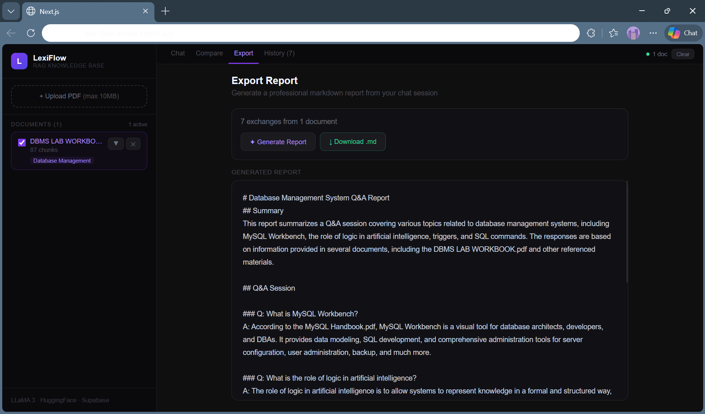

# LexiFlow ⚡

> A RAG-powered knowledge base that lets you chat with your PDF documents using AI.


## 🚀 Live Demo
**[lexi-flow-amber.vercel.app](https://lexi-flow-amber.vercel.app)**

---

## What is LexiFlow?

LexiFlow is a full-stack RAG (Retrieval-Augmented Generation) application built from scratch. Upload any PDF document and ask questions about it in natural language. The app finds the most relevant sections and generates accurate answers using LLaMA 3.

Most RAG apps use LangChain templates that do everything automatically. LexiFlow builds every layer of the pipeline manually — chunking, embedding, vector storage, retrieval, and generation.

---

## Features

- **PDF Upload** — Upload multiple PDFs and toggle which ones to search
- **Auto Summary** — Instantly generates a 3-sentence summary on upload
- **Smart Questions** — AI suggests 5 relevant questions for each document
- **Source Citations** — Every answer shows which chunks it came from with confidence scores
- **Cross-Document Comparison** — Compare two documents side by side
- **Chat History** — Persists across browser sessions
- **Export Report** — Generate a professional markdown report from your chat session
- **Mobile Responsive** — Works on all devices

---

## Tech Stack

| Layer | Technology |
|-------|-----------|
| Frontend | Next.js 14, TypeScript, React |
| LLM | LLaMA 3 via Groq API |
| Embeddings | HuggingFace all-MiniLM-L6-v2 |
| Vector DB | Supabase pgvector |
| Deployment | Vercel |

---

## How It Works

```
PDF Upload → Text Extraction → Chunking → Embedding → Supabase Storage
                                                              ↓
User Question → Embed Question → Vector Search → Top Chunks → LLaMA 3 → Answer
```

1. **Chunking** — PDF text is split into 800-character chunks with 150-char overlap
2. **Embedding** — Each chunk is converted to a 384-dimensional vector using HuggingFace
3. **Storage** — Vectors stored in Supabase using pgvector extension
4. **Retrieval** — User question is embedded and compared using cosine similarity
5. **Generation** — Top matching chunks sent as context to LLaMA 3 on Groq

---

## Getting Started

### Prerequisites
- Node.js 18+
- Supabase account (free)
- Groq API key (free)
- HuggingFace token (free)

### Installation

```bash
git clone https://github.com/06nikunj/LexiFlow.git
cd LexiFlow
npm install --legacy-peer-deps
```

### Environment Variables

Create a `.env.local` file:

```env
NEXT_PUBLIC_SUPABASE_URL=your_supabase_url
NEXT_PUBLIC_SUPABASE_ANON_KEY=your_supabase_anon_key
GROQ_API_KEY=your_groq_api_key
HF_TOKEN=your_huggingface_token
```

### Supabase Setup

Run this SQL in your Supabase SQL editor:

```sql
create extension if not exists vector;

create table documents (
  id bigserial primary key,
  content text,
  metadata jsonb,
  embedding vector(384)
);

create or replace function match_documents (
  query_embedding vector(384),
  match_threshold float,
  match_count int
)
returns table (id bigint, content text, metadata jsonb, similarity float)
language sql stable as $$
  select documents.id, documents.content, documents.metadata,
    1 - (documents.embedding <=> query_embedding) as similarity
  from documents
  where 1 - (documents.embedding <=> query_embedding) > match_threshold
  order by similarity desc
  limit match_count;
$$;
```

### Run

```bash
npx next dev
```

Open [http://localhost:3000](http://localhost:3000)

---

## Project Structure

```
LexiFlow/
├── app/
│   ├── api/
│   │   ├── chat/        # RAG query endpoint
│   │   ├── upload/      # PDF processing endpoint
│   │   ├── analyze/     # Auto summary + questions
│   │   ├── compare/     # Cross-document comparison
│   │   └── export/      # Report generation
│   ├── lib/
│   │   ├── embeddings.ts   # HuggingFace embeddings
│   │   ├── supabase.ts     # Database client
│   │   ├── chunkText.ts    # Text chunking
│   │   └── extractText.ts  # PDF text extraction
│   └── page.tsx            # Main UI
├── next.config.js
└── package.json
```

---

## Built By

**Nikunj Purohit** — SRM Institute of Science & Technology

---

## License

MIT

## Screenshots





